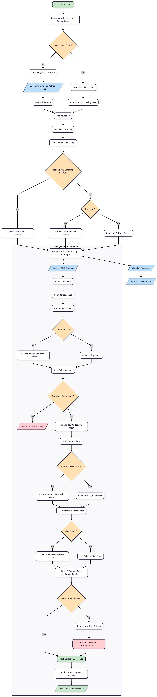

# 🚀 DBF Gateway

**DBF Gateway** is a lightning-fast, highly configurable attendance and redirection tool. Designed as a generic tool for
any online gathering (such as YMHT sessions, MBA sessions, or general satsangs), it seamlessly logs participant data
before routing them to their respective online meetings.

---

## 🛠 Tech Stack

* **Framework**: Next.js 16 (App Router)
* **UI Library**: HeroUI
* **Styling**: Tailwind CSS v4
* **Language**: TypeScript
* **UI Designing**: Figma

<p align="center">
    <a href="https://www.dadabhagwan.org/">
        
    </a>
</p>

---

## ✨ Key Features

* ⚙️ **Dynamic Configuration**: Change the session name, banner image, meeting links, and footer text in a single
  configuration file without touching core application code.
* ⚡ **Frictionless Check-in (Smart Memory)**: Utilizes local storage to remember users who have joined previously from
  the same device. Users can rejoin with a single click via the "Join As" list.
* 🎨 **Deterministic Avatars**: Automatically generates consistent, beautiful user avatars using the DiceBear API based
  on the user's name.
* 📍 **Rich Telemetry**: Automatically captures the user's generalized location (City) and generates a unique device ID
  for accurate attendance tracking.
* 🔊 **Interactive Audio**: Custom audio feedback for actions like toggling Dark/Light mode or deleting a saved user
  profile.
* 📊 **Google Sheets Integration**: Seamlessly POSTs all attendance data to a Google Apps Script webhook, directly
  populating a Google Sheet.
* 📱 **Fully Responsive**: Features a modern, split-screen layout on desktop that elegantly collapses into a stacked,
  highly readable view on mobile devices.

---

## 📂 Quick Setup

### 1. Prerequisites

Ensure you have [Node.js](https://nodejs.org/) (v18+) and your preferred package manager installed.

### 2. Installation

Clone the repository and install the dependencies:

```bash
git clone https://github.com/Divyansh-Gemini/dbf-gateway
cd dbf-gateway
npm install
```

### 3. Environment Variables

Create a `.env.local` file in the root directory and add your required credentials:

```env
# Google Apps Script Web App URL for logging attendance
NEXT_PUBLIC_GOOGLE_SCRIPT_URL=https://script.google.com/macros/s/xyz.../exec

# The destination meeting link (Google Meet, Zoom, etc.)
NEXT_PUBLIC_MEET_URL=https://meet.google.com/xyz-xyz-xyz

```

### 4. Customization

* **Text & Links**: Update `src/config/site.ts` with your specific event details.
* **Assets**: Replace the default logos and banners inside the `public/assets/` folder with your own.

### 5. Run Locally

Start the development server:

```bash
npm run dev
```

Visit `http://localhost:3000` to view the application.

---

## 📝 How it Works (User Flow)

Below is the visual representation of the system's architecture and user journey:

<p align="center">
  
</p>

1. **Identify**: The app identifies the user's device and fetches their generalized location on page load.
2. **Submit/Select**: New users enter their details (Name, Mobile, optional MHT ID). Returning users simply click their
   saved profile.
3. **Log**: Data is dispatched to a Google Sheet via a background API call.
4. **Join**: Upon successful logging, the user is instantly redirected to the meeting link.

---

## 📊 Data Storage

Attendance data is sent to a Google Apps Script webhook endpoint. The payload includes the following fields:

* Name
* Mobile Number
* **MHT ID** *(Optional)*
* Location (City)
* Device ID
* Timestamp (ISO 8601 Format)

---

## 🚀 Deployment

The project is deployed using **Vercel CI/CD pipelines** for zero-downtime updates.

| Branch    | Environment | Purpose                       |
|-----------|-------------|-------------------------------|
| `main`    | Production  | Live public site              |
| `develop` | Development | Testing & preview environment |

*Note: Pushing to these branches automatically triggers a deployment on Vercel.*

---

## 🌿 Branching Strategy

We follow a feature‑branch Git workflow to maintain code quality and prevent merge conflicts.

### Naming Conventions

```text
feature/<feature-name>
bugfix/<issue-name>
```

### Development Flow

1. Branch off from `develop` (`git checkout -b feature/my-new-feature`).
2. Commit your changes locally.
3. Push to origin and open a Pull Request targeting the `develop` branch.
4. Once tested and approved on the Dev environment, `develop` is merged into `main` for Production release.

---

## 🤝 Contribution Guidelines

* **Never** push directly to `main` or `develop`.
* Always use descriptive feature or bugfix branches.
* Ensure the build passes locally (`npm run build`) before opening a PR.
* Keep commits focused, meaningful, and atomic.

---

## 📌 Purpose

The goal of DBF Gateway is to provide a **fast, reusable attendance gateway** for any online gathering without needing a
new project each time — only configuration changes.
